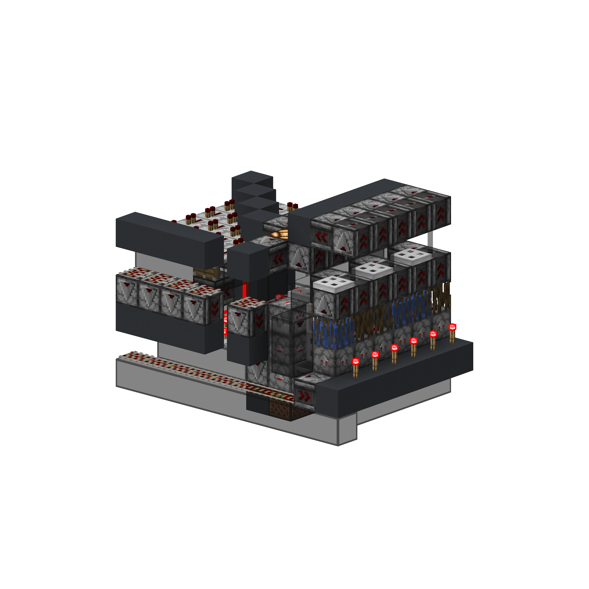
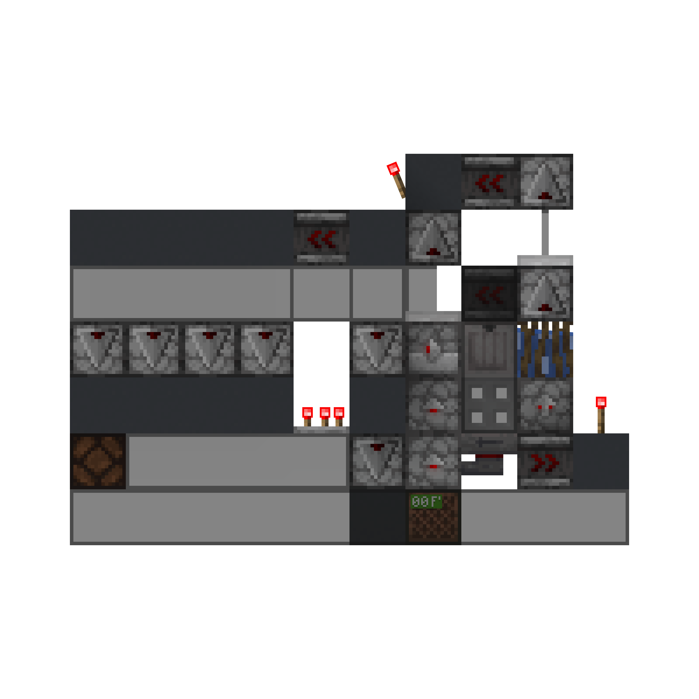
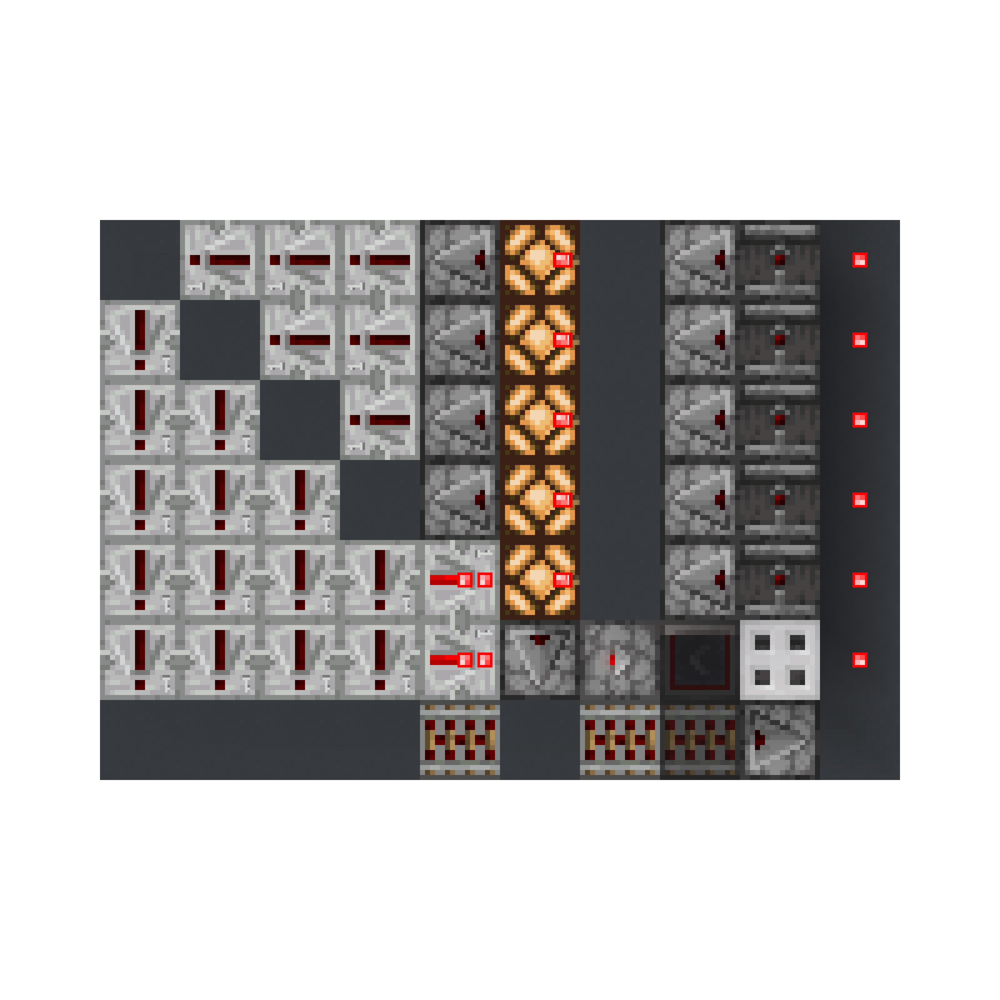

<!-- update-timestamp: 2026-04-25T22:24:13.623000+00:00 -->
me and X8Ghost did a bit of improvements to the seral decoder mainly them tbf

[View Discord message](https://discord.com/channels/@me/1520002350708686899/1544752925782315069)

## Media

<!-- update-timestamp: 2026-04-25T17:45:08.685000+00:00 -->
_No text was included in this update._

[View Discord message](https://discord.com/channels/@me/1520002350708686899/1544752825450504232)

## Media

<!-- update-timestamp: 2026-04-25T16:09:12.383000+00:00 -->
this is more like it!

[View Discord message](https://discord.com/channels/@me/1520002350708686899/1544752762770821232)

## Media

<!-- update-timestamp: 2026-04-25T13:39:52.548000+00:00 -->
demo receiver just to see if the serial idea works and it dose. (I'm fully aware of the QC issue with the droppers this was purely to see if it will work) 

so yea this will be completely redone but as for the idea it works

[View Discord message](https://discord.com/channels/@me/1520002350708686899/1544752715350024372)

## Media

<!-- update-timestamp: 2026-04-25T07:44:15.330000+00:00 -->
Ehh not really. 

Basically if we just use a normal receiver and transmitter the entire code (item code + amount + location ID in this case) would need to be how many bits the receiver is. If we have an 8 bit code and 4 bits for the amount (each value = 27 boxes) and the location is say 10 bits that’s 22 bits total so the receiver will need to be 22 bits and therefore 22 blocks long + front end stuff. 

However with my idea I preposed we could send that 22 bit code in 5 bit blocks and read them in serial. 

Think of it like so:

000000000000000

If we assume 4gt per bit in this code we can group them into 20gt segments 

00000 | 00000 | 00000

Now we send those 5 bit segments 20gt apart to the transmitter 

So the receiver would receive something like so 

00000 - 20gt - 00000 - 20gt - 00000

This on its own isn’t very helpful as we are just setting a sequence of 5 bit codes however if we read those incoming codes in serial 4gt part you end with with a constant 4gt per bit output. Because of the way the timings work 

0 - 4gt - 0 - 4gt - 0 - 4gt - 0 - 4gt - 0 

By the time the 6th bit is needed the transmitter will have sent another 5bit code and so on the receiver will then send that in serial too and there’s no gap in the code

[View Discord message](https://discord.com/channels/@me/1520002350708686899/1544759366979158087)
