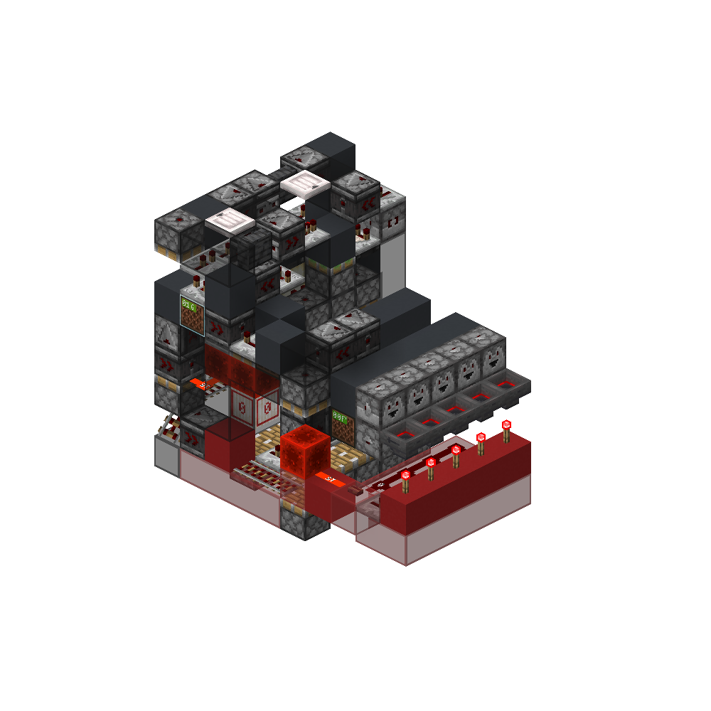
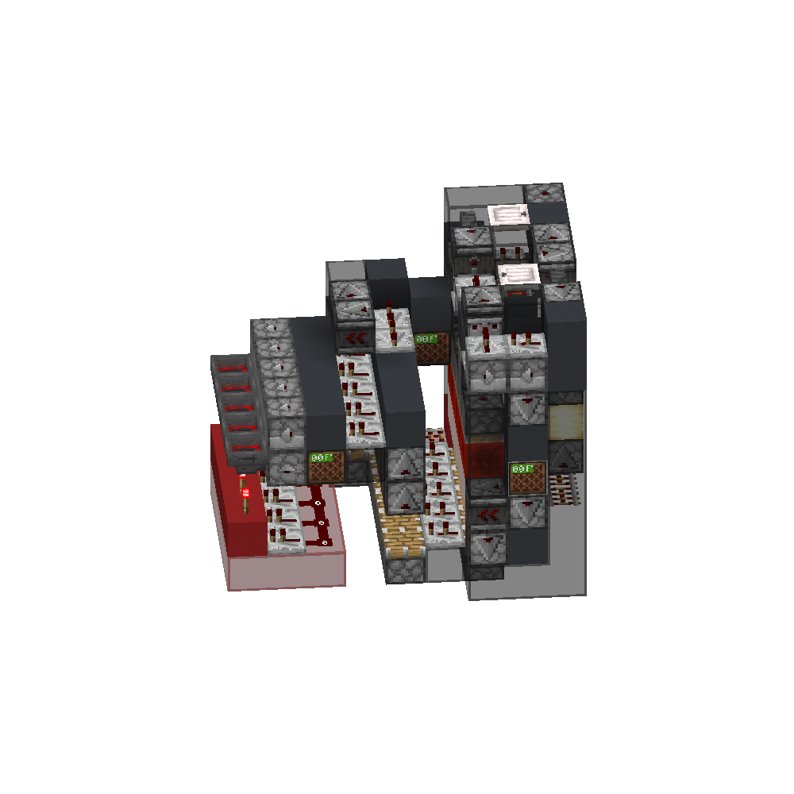
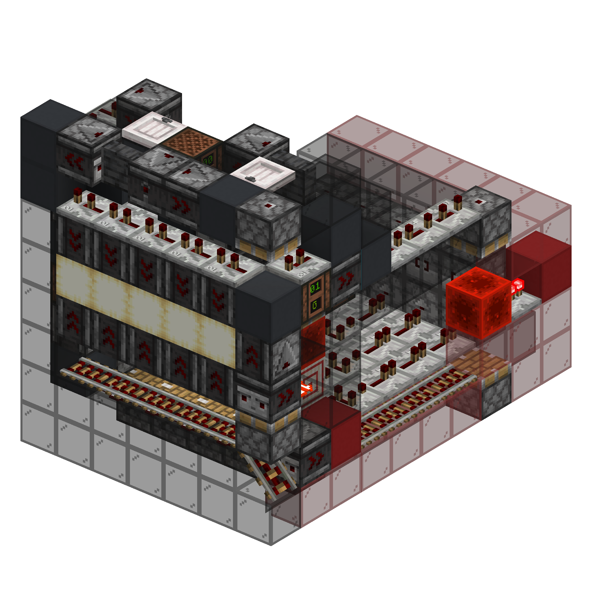
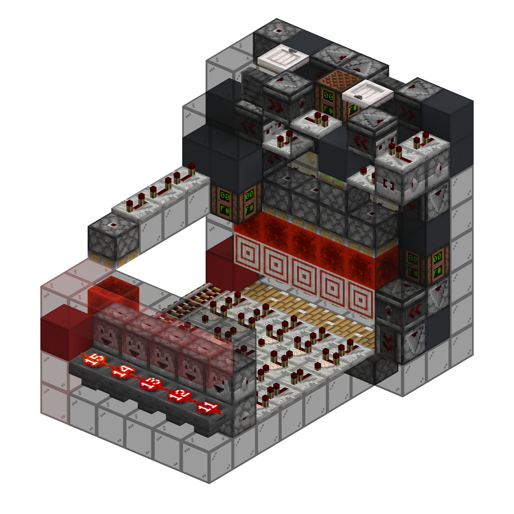

<!-- update-timestamp: 2026-05-02T13:07:03.299000+00:00 -->
now with BED based wireless (channel selector will be external)

[View Discord message](https://discord.com/channels/@me/1520002350708686899/1544753169848864890)

## Media

<!-- update-timestamp: 2026-05-02T12:00:10.292000+00:00 -->
compacted and actually working transmitter

[View Discord message](https://discord.com/channels/@me/1520002350708686899/1544753134667042986)

## Media

