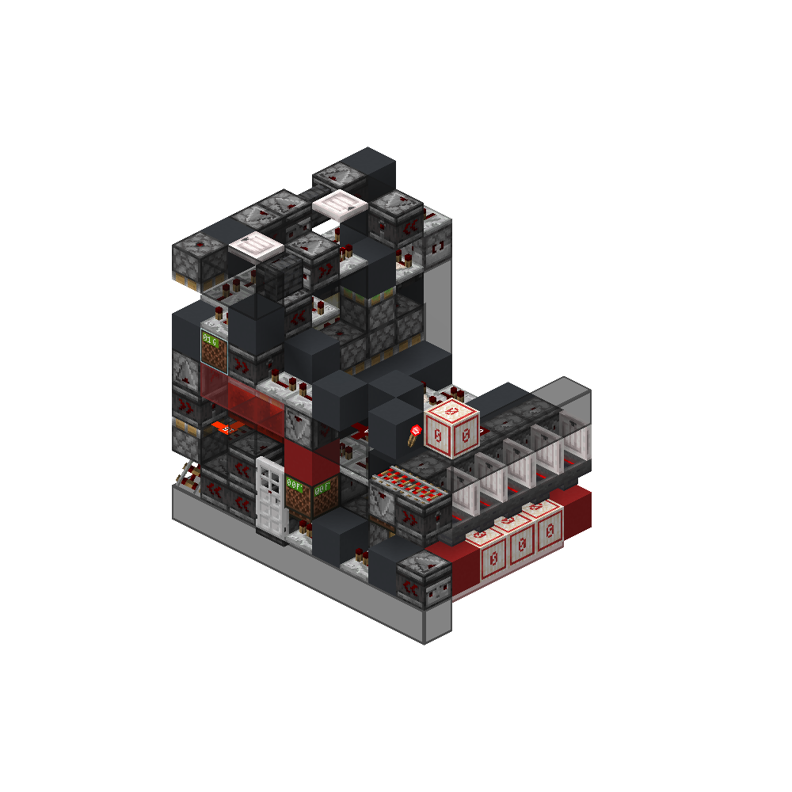
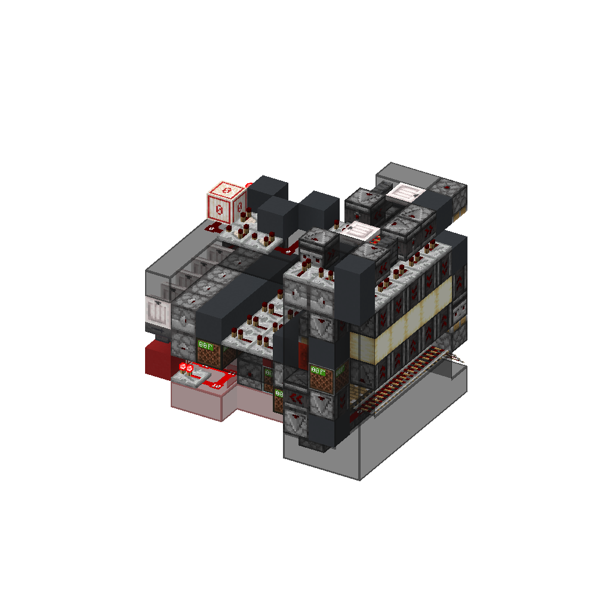
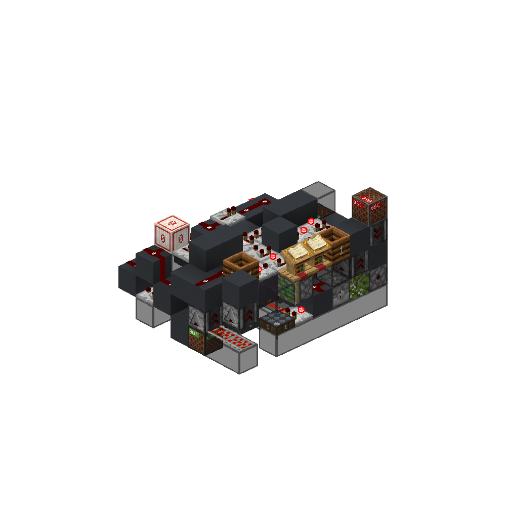
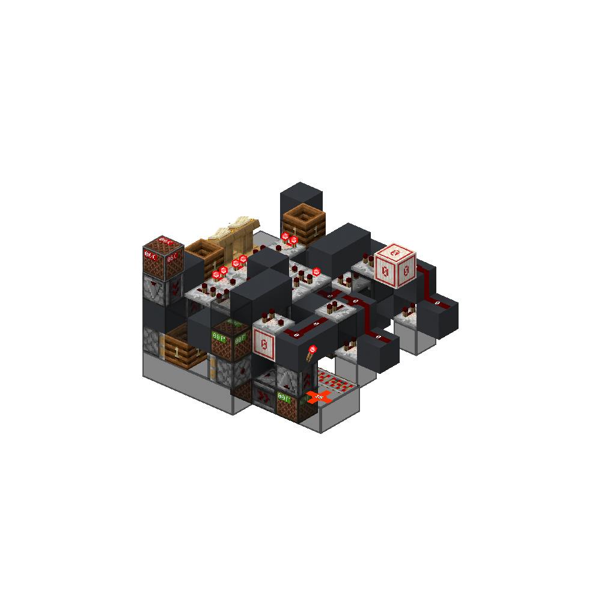
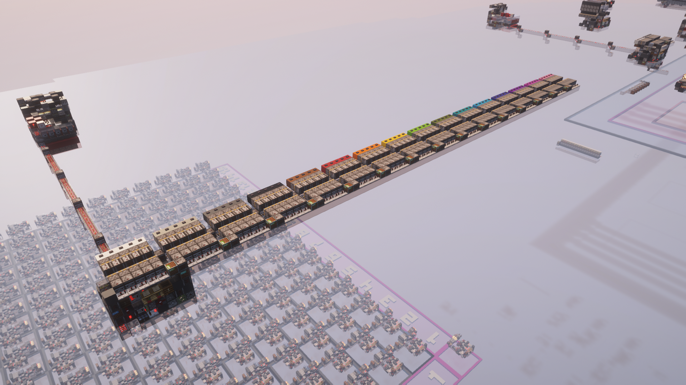
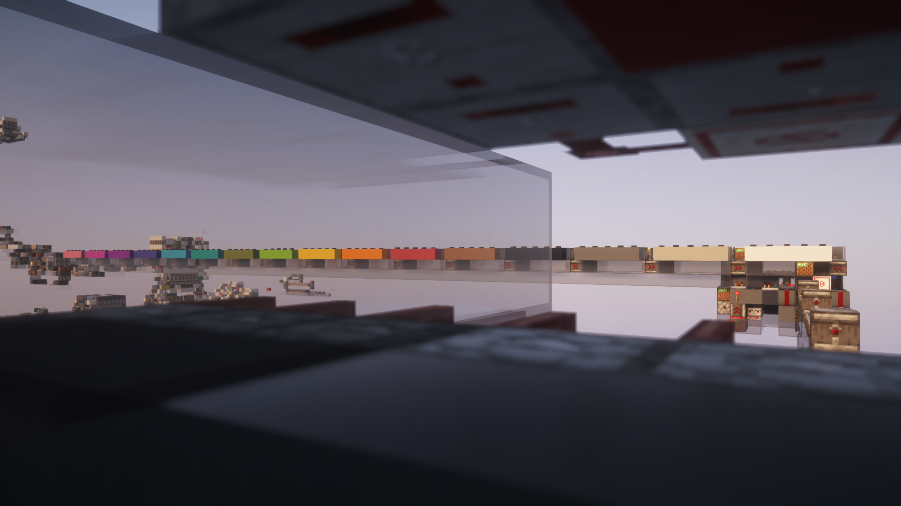
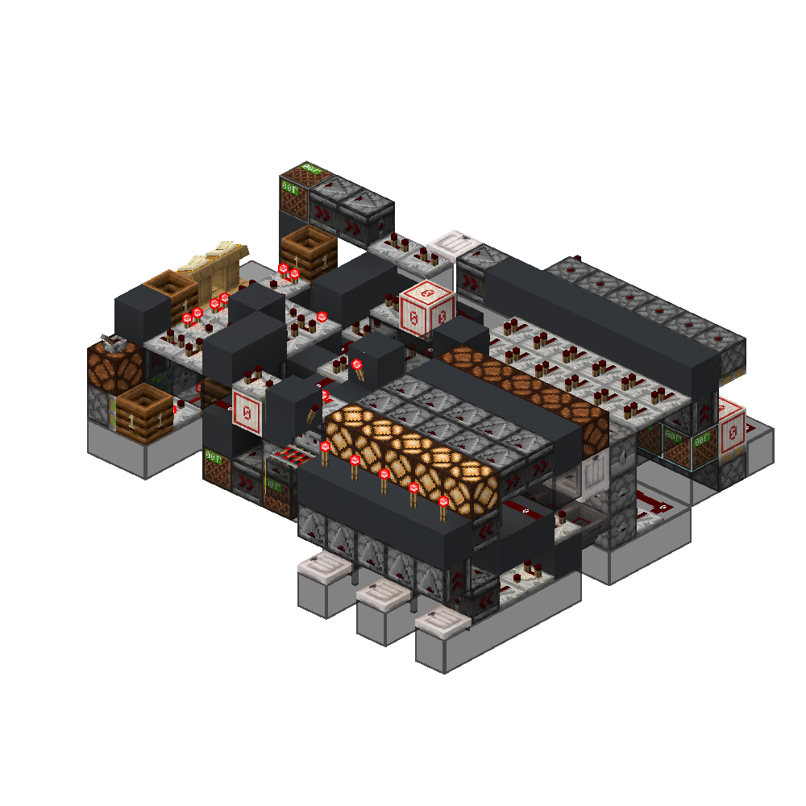
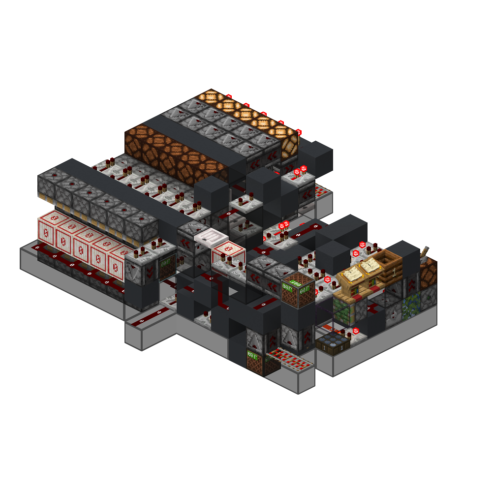

<!-- update-timestamp: 2026-05-10T17:29:21.793000+00:00 -->
its not timed at all but i have to be somewhere sooooooooo progress?

[View Discord message](https://discord.com/channels/@me/1520002350708686899/1544753608740831393)

<!-- update-timestamp: 2026-05-10T13:12:50.324000+00:00 -->
sooooo it works with any number of bits as the input

[View Discord message](https://discord.com/channels/@me/1520002350708686899/1544753537228087446)

<!-- update-timestamp: 2026-05-10T01:58:22.741000+00:00 -->
8 bit (2 hex codes) channel selection logic

[View Discord message](https://discord.com/channels/@me/1520002350708686899/1544753492508287118)

<!-- update-timestamp: 2026-05-10T01:57:38.106000+00:00 -->
Updated transmission logic

[View Discord message](https://discord.com/channels/@me/1520002350708686899/1544753459343921202)

## Media

