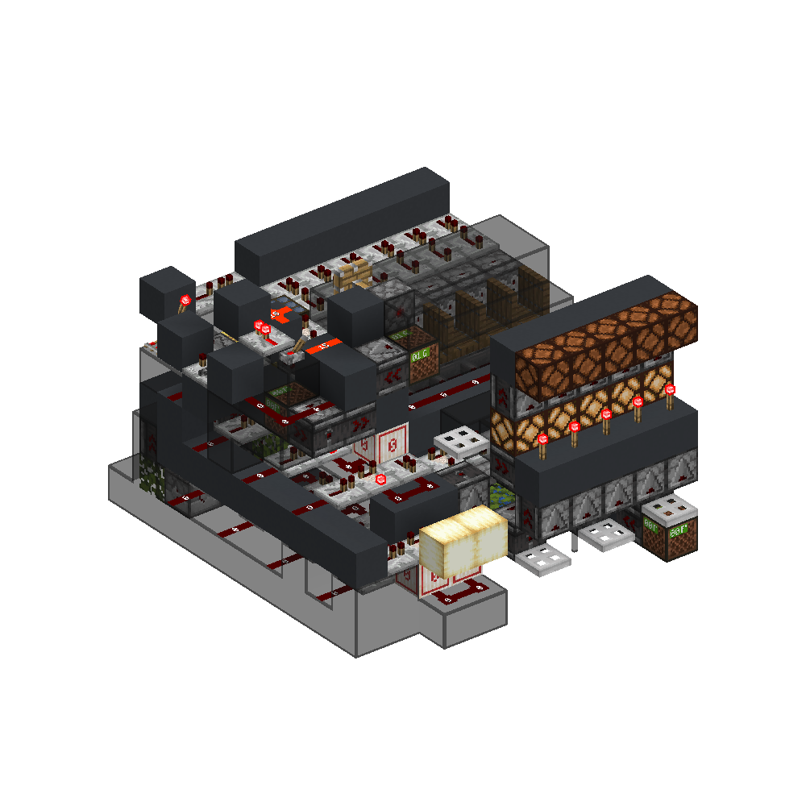
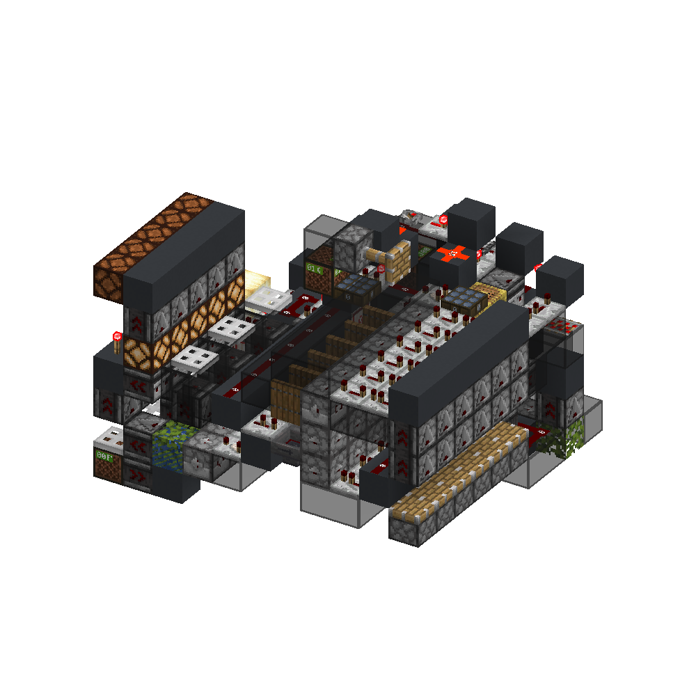
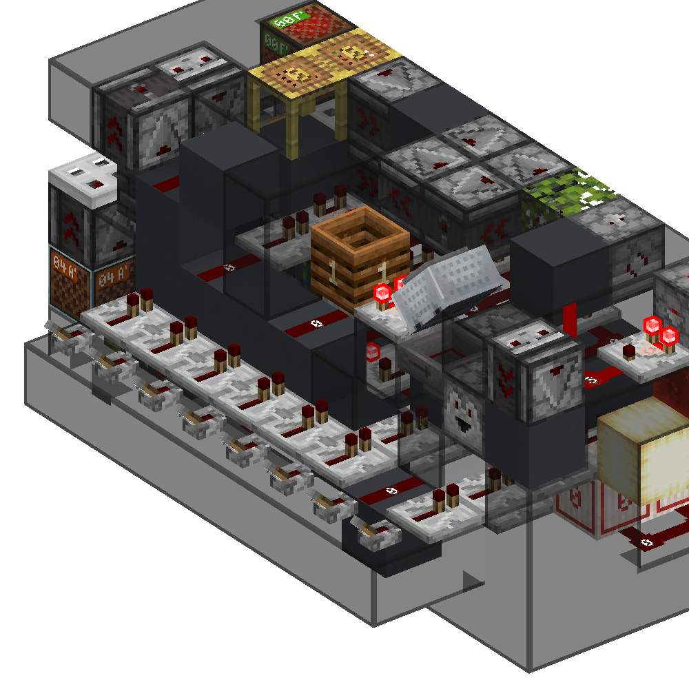
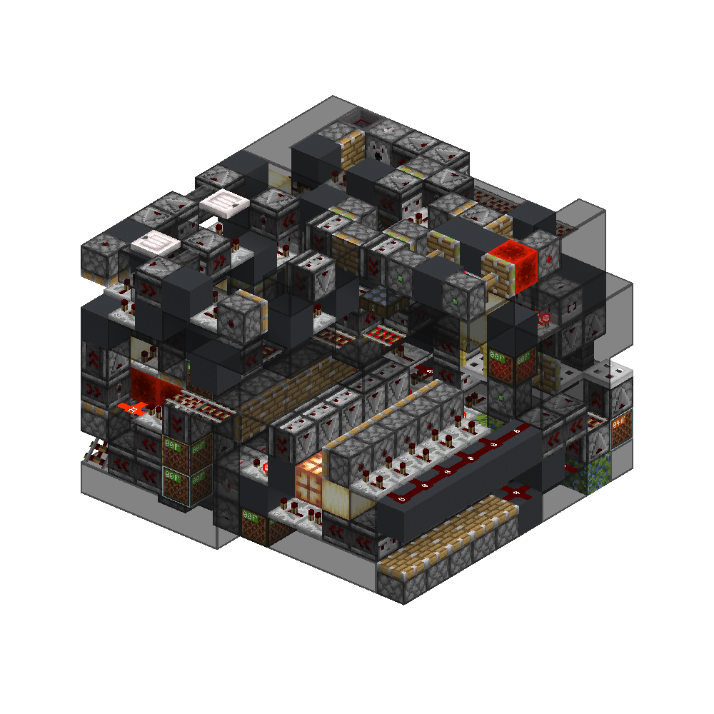
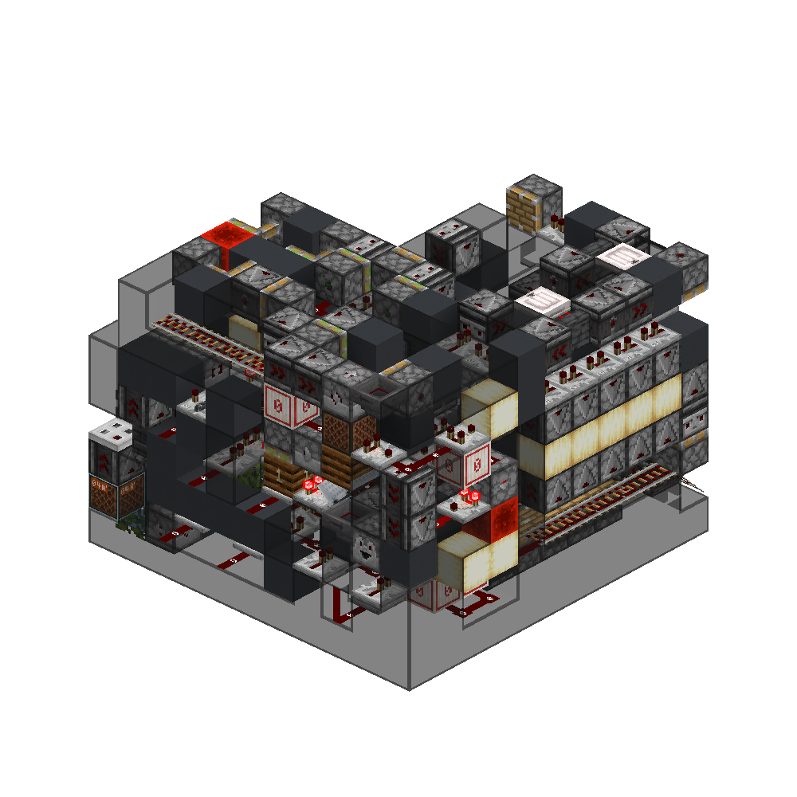

<!-- update-timestamp: 2026-05-16T23:49:41.736000+00:00 -->
Receiver just needs the serial logic adding but ima go sleep.. if anyone wants to have a shot at it you can

[View Discord message](https://discord.com/channels/@me/1520002350708686899/1544753862185975818)

## Media

<!-- update-timestamp: 2026-05-16T19:48:44.553000+00:00 -->
The channel selection in put is a bit... cringe but yeah

[View Discord message](https://discord.com/channels/@me/1520002350708686899/1544753751611547780)

## Media

<!-- update-timestamp: 2026-05-16T19:48:09.218000+00:00 -->
Transmitter + Code Box Reader

[View Discord message](https://discord.com/channels/@me/1520002350708686899/1544753712189411358)

## Media

