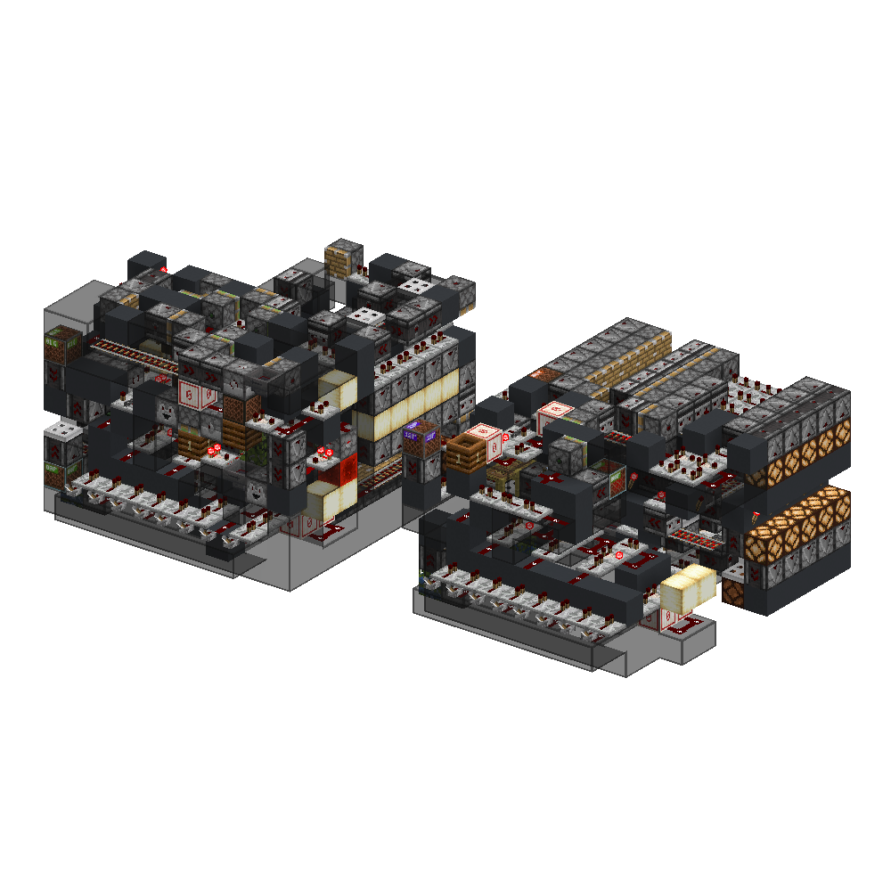
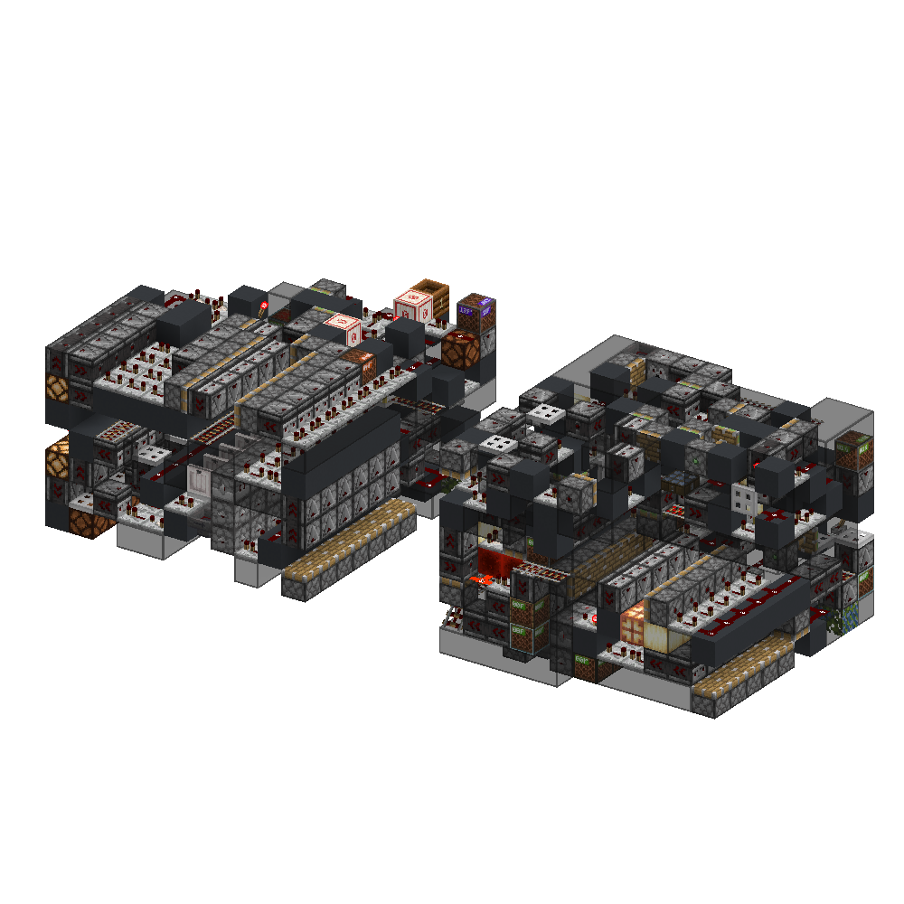
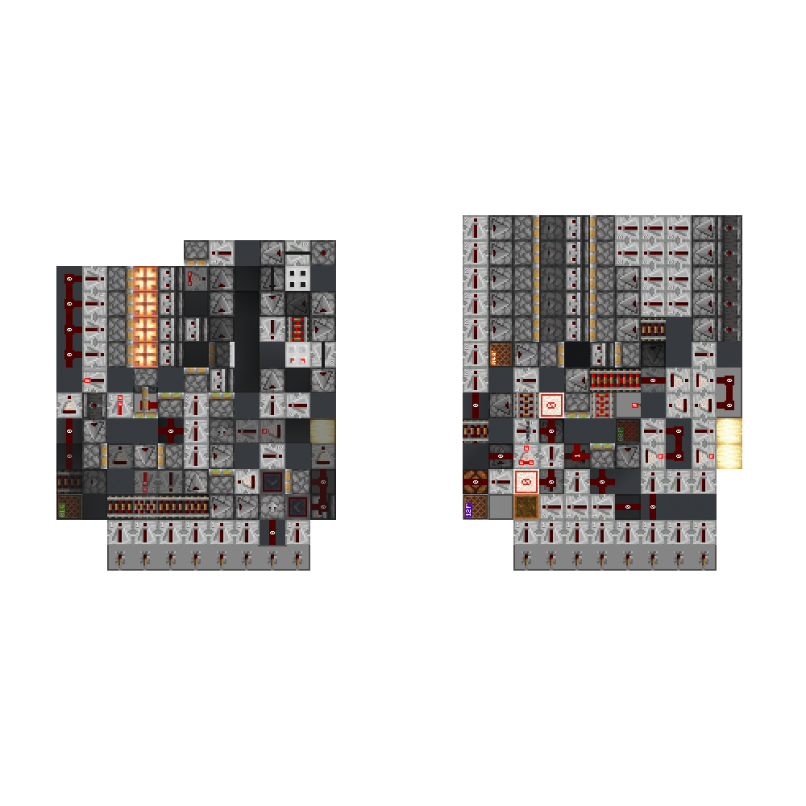
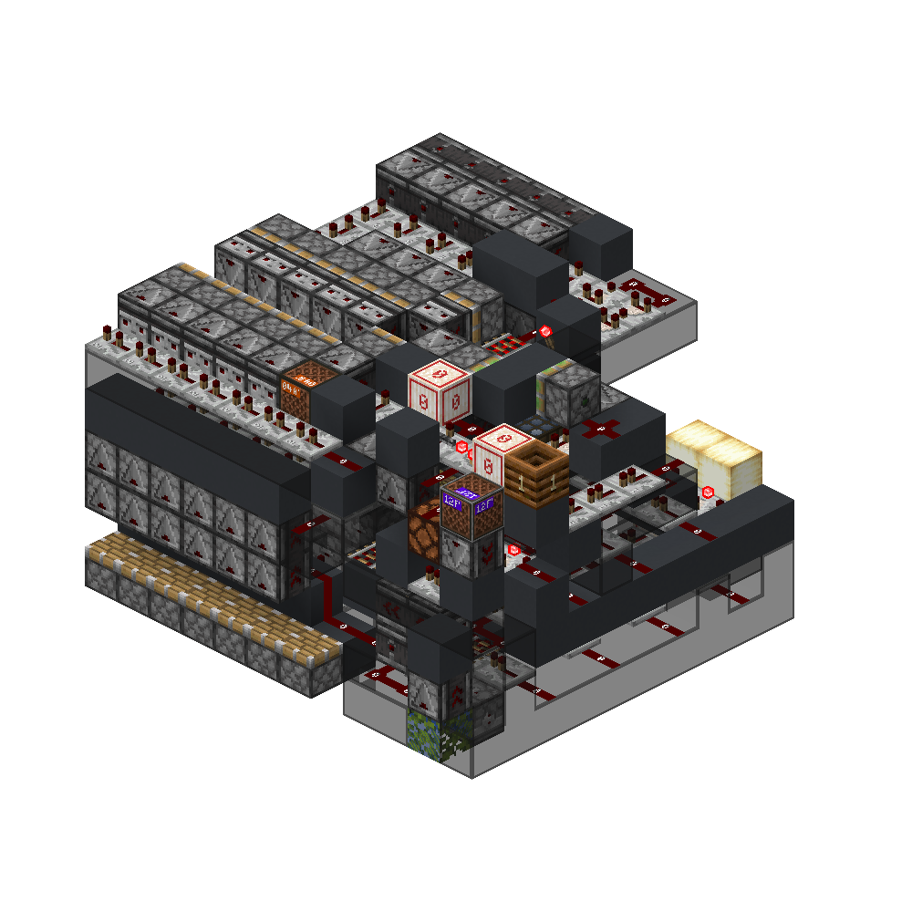
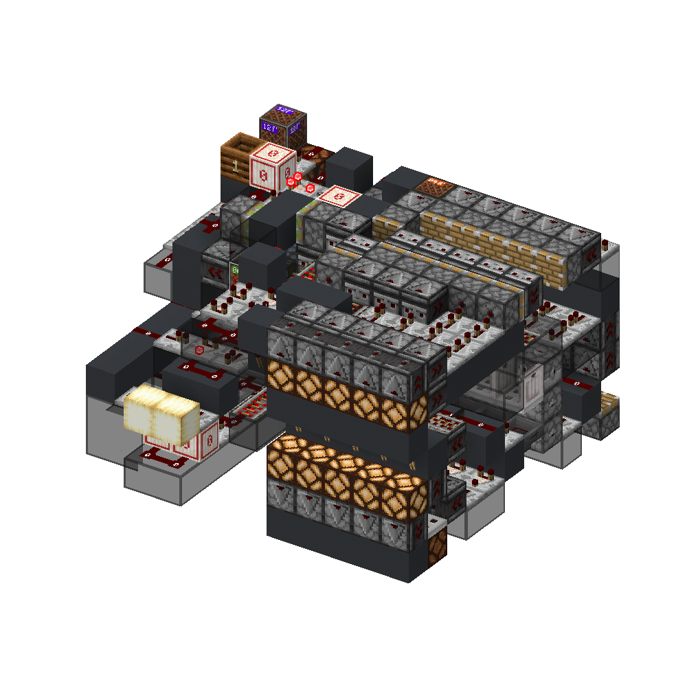
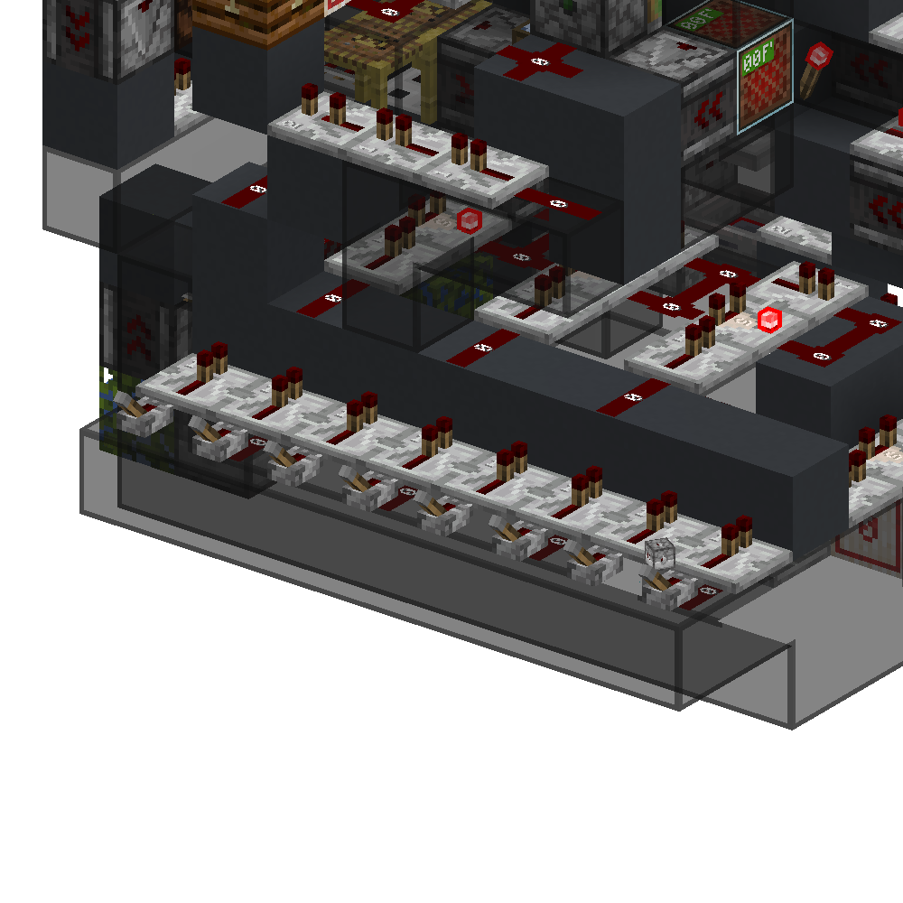
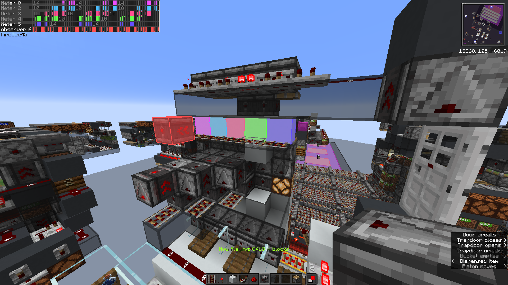

<!-- update-timestamp: 2026-05-17T23:28:58.581000+00:00 -->
Receiver and the Transmitter (now bug fixed) I'm very happy with them.. like so happy lol

[View Discord message](https://discord.com/channels/@me/1520002350708686899/1544754238926618745)

## Media

<!-- update-timestamp: 2026-05-17T23:27:22.105000+00:00 -->
Receiver + serial output DONE!!

[View Discord message](https://discord.com/channels/@me/1520002350708686899/1544754112556568698)

## Media

<!-- update-timestamp: 2026-05-17T19:46:21.638000+00:00 -->
i think i have the timings down good!

[View Discord message](https://discord.com/channels/@me/1520002350708686899/1544753989319528538)

## Media

