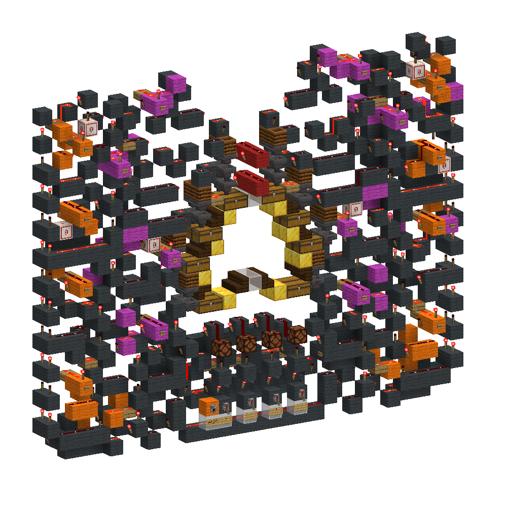
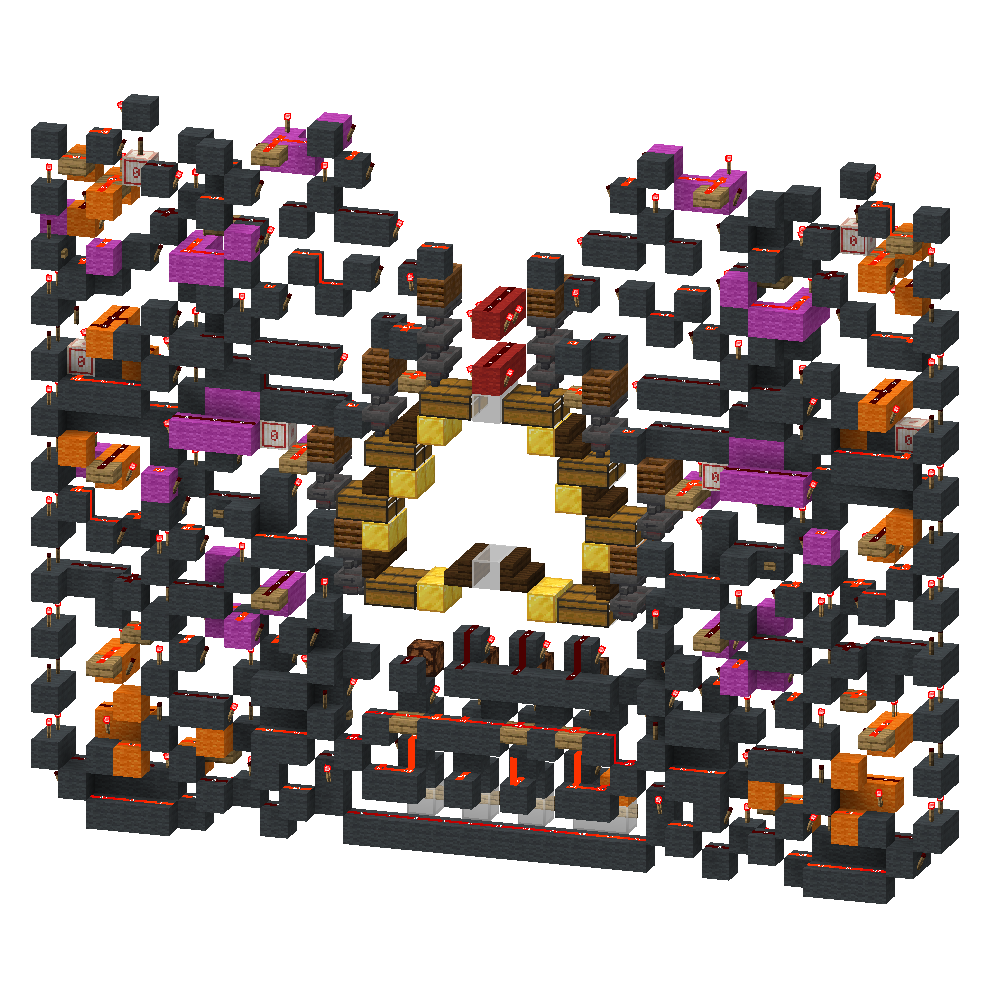
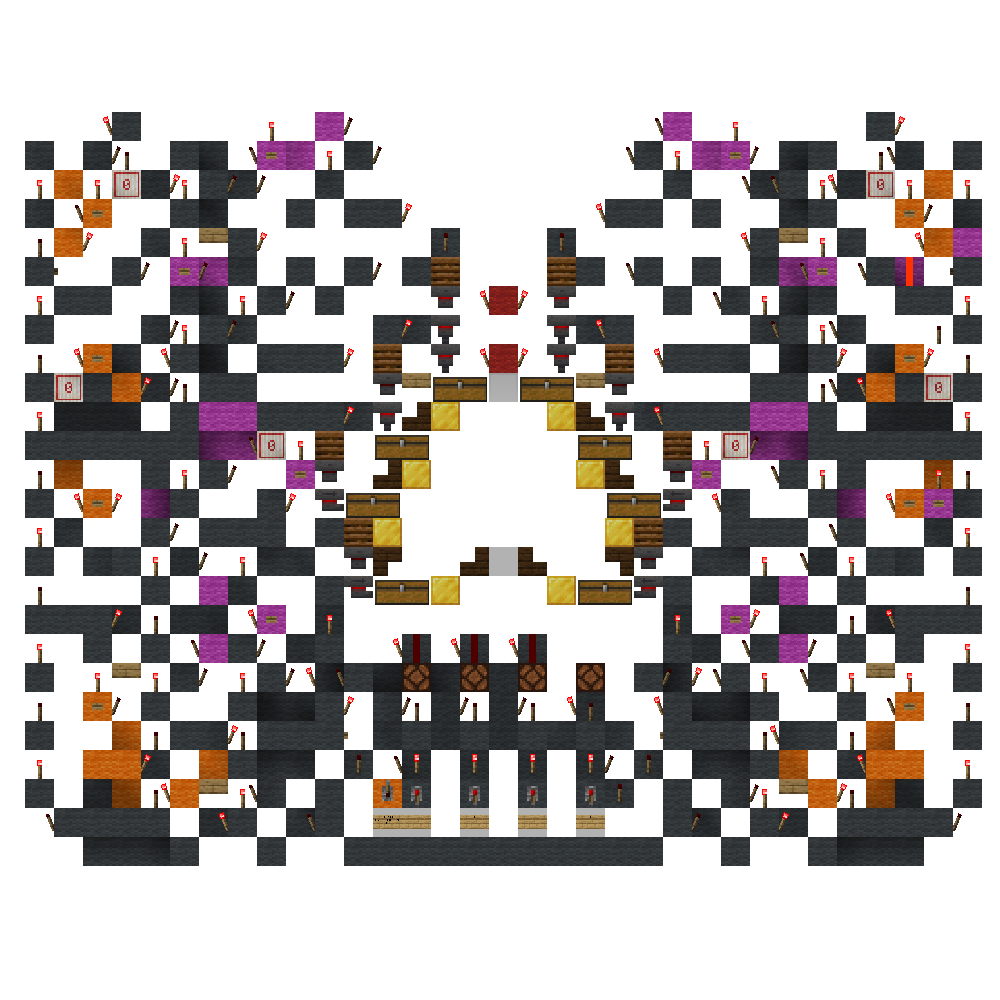

<!-- update-timestamp: 2026-06-14T19:48:22.562000+00:00 -->
_No text was included in this update._

[View Discord message](https://discord.com/channels/@me/1520002350708686899/1544717709869187123)

## Media

<!-- update-timestamp: 2026-06-14T19:48:02.582000+00:00 -->
The magenta lines reset the latches in that row and would set that row to be free to use again

[View Discord message](https://discord.com/channels/@me/1520002350708686899/1544717744350560316)

<!-- update-timestamp: 2026-06-14T19:47:24.207000+00:00 -->
The chest hall is going to need some explaining as I’ve not at all discussed how this will work. 

The reason it looks a lot bigger and complicated than might seem necessary is because this is a matrix hall. It can individually unlock hoppers within a slice. A normal encoded hall will unlock all the hoppers in the slice and just send items to one of the 8 rows of hoppers via a demux to unload into that chest. This works differently and as a result can be up to 8x faster. 

Instead of unlocking all the hoppers in a single slice, as mentioned it will unlock specificity 1. This is done by attempting to unlock them all but it only unlocks when one of the orange lines gets pulsed. This then sets a latch in the hall to keep that hopper unlocked while you’re unloading items into that chest / row of hoppers. Where the speed comes from is now you can select a different row that isn’t in use and the slice and unlock that hopper too. Meaning you are now unloading 2 item types to two different rows of the hall at the same time. And they don’t have to be in the same slice. You can do this for all 8 rows of chests meaning upwards of 8x unloading into the hall.

[View Discord message](https://discord.com/channels/@me/1520002350708686899/1544717640046747669)
