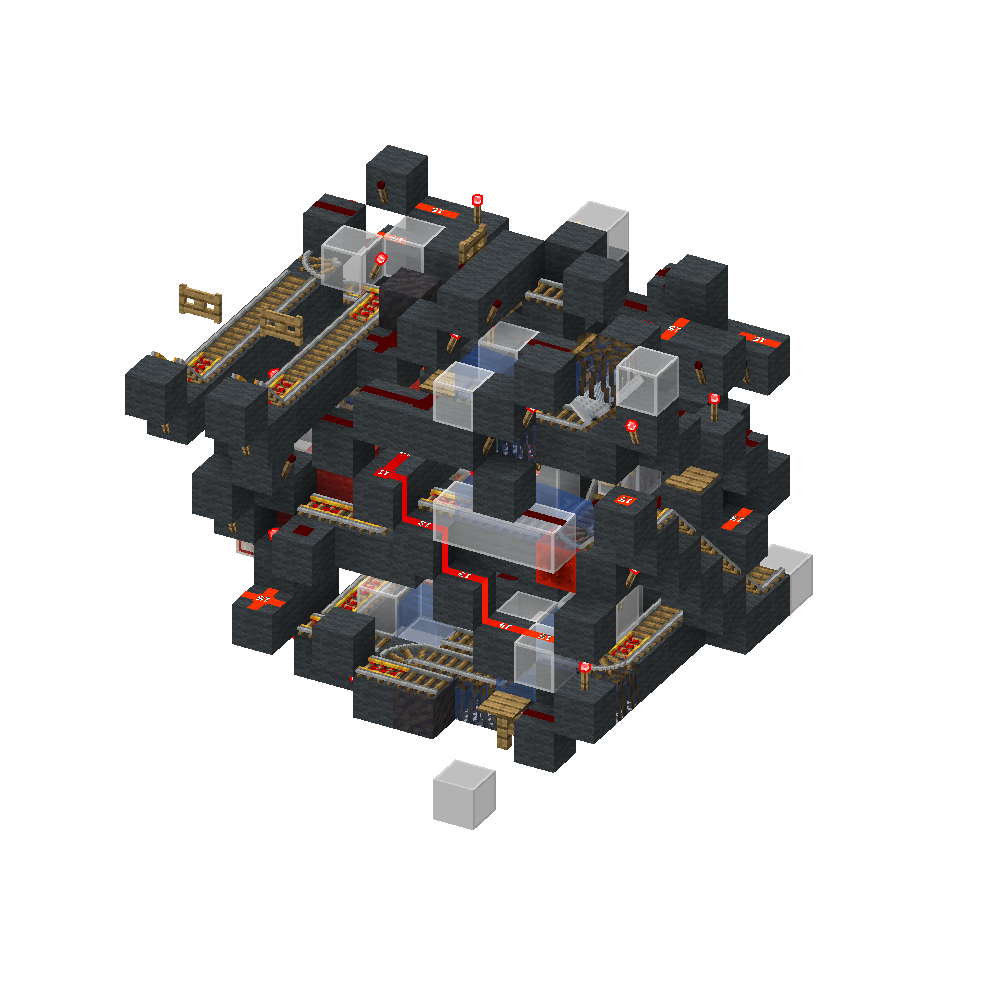
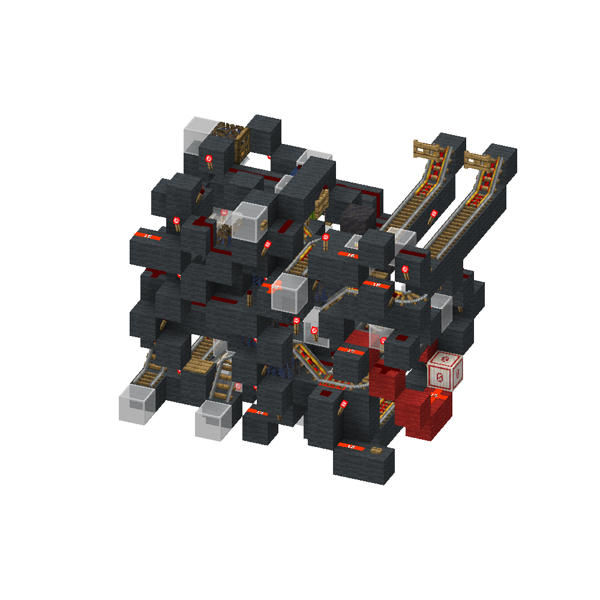

<!-- update-timestamp: 2026-07-19T18:06:10.303000+00:00 -->
```ansi
Cart Merger
      │
      │
Optimise Input
(Left = Most Full, Right = Least Full)
      │
      │
Unload for ~128-ish GT
(~64 Items @ 4× Hopper Speed)
      │
      │
Is Unloading Cart Empty?
├── YES
│   │
│   Send Empty Cart to Holding
│   │
│   Is Loading Cart Full?
│   ├── YES → Full Carts Output
│   │                │
│   │                Send Empty Cart through Loader
│   │                │
│   │                Part Full Output
│   │
│   └── NO → Part Full Output
│                    │
│                    Send Empty Cart through Loader
│                    │
│                    Part Full Output
│
└── NO
    │
    Send Unloading Cart to Holding
    │
    Is Loading Cart Full?
    ├── YES → Full Carts Output
    │                │
    │                Send Unloading Cart through Loader
    │                │
    │                Part Full Output
    │
    └── NO
        │
        Return Loading Cart to Loading Position
        │
        Return Unloading Cart to Unloader
        │
        Restart ~128-ish GT Timer
```

[View Discord message](https://discord.com/channels/@me/1520002350708686899/1544727702786023445)

<!-- update-timestamp: 2026-07-19T18:05:53.306000+00:00 -->
In super simple terms this takes two carts and unloads one into the other until either the cart being loaded becomes full or the cart being unloaded becomes empty.

A more detailed explanation is as follows.

The input is first optimised so the left side always contains the fuller of the two carts and the right side contains the least full. This reduces the amount of unloading required, as only the least full cart needs to be emptied. The least full cart is unloaded for approximately 128-ish game ticks. This is roughly the amount of time required to transfer one stack of 64 items at 4× hopper speed. After the timer expires, the unloading cart is checked to see if it is empty. If it is, the cart is sent to a holding point and the loading cart is checked to see if it is full. If the loading cart is full it is sent to the "Full Carts" output, while the empty cart is sent through the loader to collect any remaining items left in the hoppers before being sent to the "Part Full" output. If the loading cart is not full it is simply sent to the "Part Full" output. If the unloading cart is not empty after the timer expires, it is moved into a holding position while the loading cart is checked to see if it is full. If the loading cart is full it is sent to the "Full Carts" output, while the unloading cart is sent through the loader to collect any remaining items before being sent to the "Part Full" output. If the loading cart is not full, it is returned to the loading position, the unloading cart is sent back to the unloader, and the 128-ish game tick timer starts again. This loop repeats until either the loading cart becomes full or the unloading cart becomes empty.

If that didn’t make sense here’s a logic flow to visualise it. https://discord.com/channels/1172733344077860925/1515803139880784043/1528462973298020462

[View Discord message](https://discord.com/channels/@me/1520002350708686899/1544717960944558191)

<!-- update-timestamp: 2026-07-19T17:38:01.242000+00:00 -->
cart merger... ill give more info in a sec

[View Discord message](https://discord.com/channels/@me/1520002350708686899/1544717934184890558)

## Media




<!-- update-timestamp: 2026-07-19T10:34:47.766000+00:00 -->
(this looks better on desktop but oh well)
```ansi
Splitter Output
│
│
Is fill level ≥ 2?
├── YES
│   │
│   Is fill level = 15?
│   ├── YES → Send to Encoder
│   └── NO → Continue normal stacked-item handling
│
└── NO (Fill level < 2)
    │
    Does cart have an unstackable?
    ├── YES (remove it)
    │   │
    │   Is cart empty?
    │   ├── YES → Return to Splitter Cart Storage
    │   └── NO → Send to "Has Bulk Item Check" (not apart of the splitter)
    │
    └── NO → Send to "Has Bulk Item Check" (not apart of the splitter)
```

[View Discord message](https://discord.com/channels/@me/1520002350708686899/1544724798649671820)
