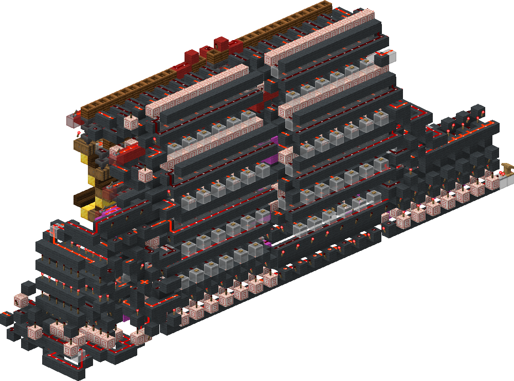
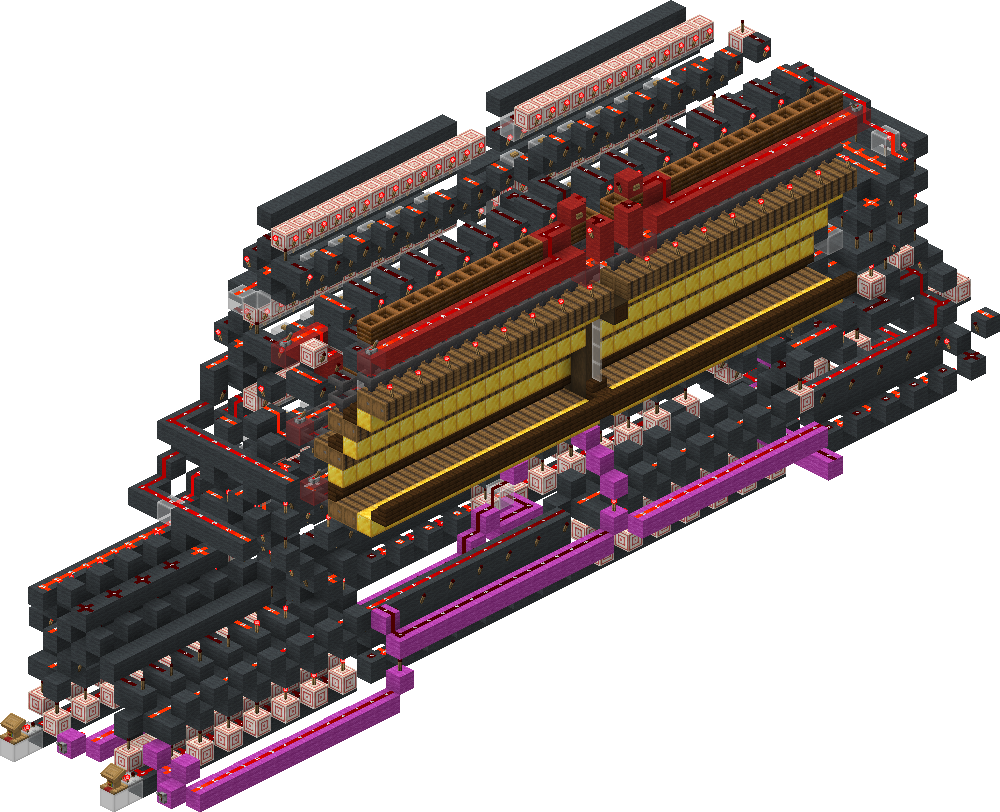
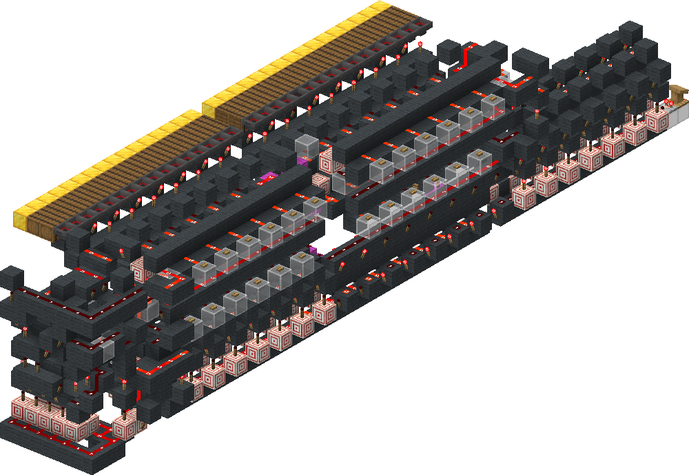
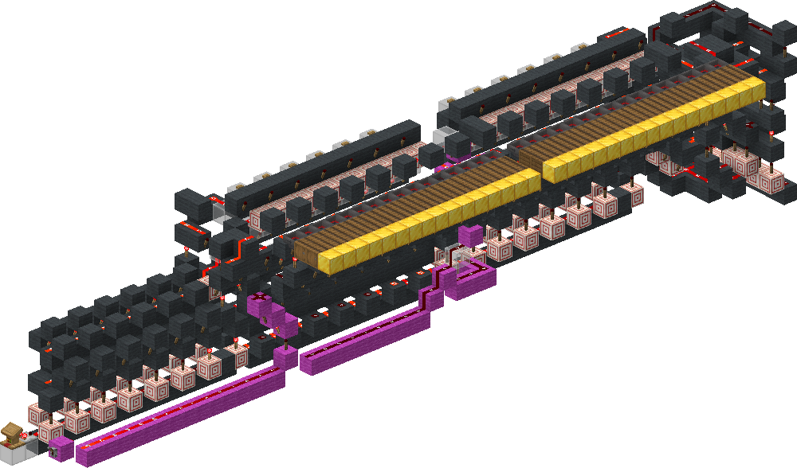

<!-- update-timestamp: 2026-07-27T19:09:45.712000+00:00 -->
2/4... the back can be smaller but I'm leaving room for the overflow detection. also the front fits under the floor so that size wise isn't an issue. the other 2 hex lines will be on top for obvious reasons lol. Oh and i added all the redcoders now, and this hall has the potential to be FHL (Fully Hopper Locked) which is cool af

[View Discord message](https://discord.com/channels/@me/1520002350708686899/1544718242268975114)

## Media

<!-- update-timestamp: 2026-07-27T14:04:08.297000+00:00 -->
Ok so… this is just 2 redcoders that i switch between to only have one output. All the messy looking wiring at each end is just wiring to get the signal strength into the redcoder. The magenta line is the selection between each one, it just provides a super high SS to the redcoder and blocks 15 and 0 on the given one. What this means is with a hex signal and a 1 bit binary signal aka a 5 bit code like before… I can just keep the code on the given line on until it’s done unloading. Meaning I don’t need latches in the hall, I don’t need complicated set and reset logic, none of it. I can just keep a code in memory….

[View Discord message](https://discord.com/channels/@me/1520002350708686899/1544718216339652608)

<!-- update-timestamp: 2026-07-27T13:53:09.122000+00:00 -->
i had an idea to make the hall a lot simpler ill explain in <#1515803139880784043> in a sec but basically this is just a redcoder (a 32 output one)

[View Discord message](https://discord.com/channels/@me/1520002350708686899/1544718176913457262)

## Media

