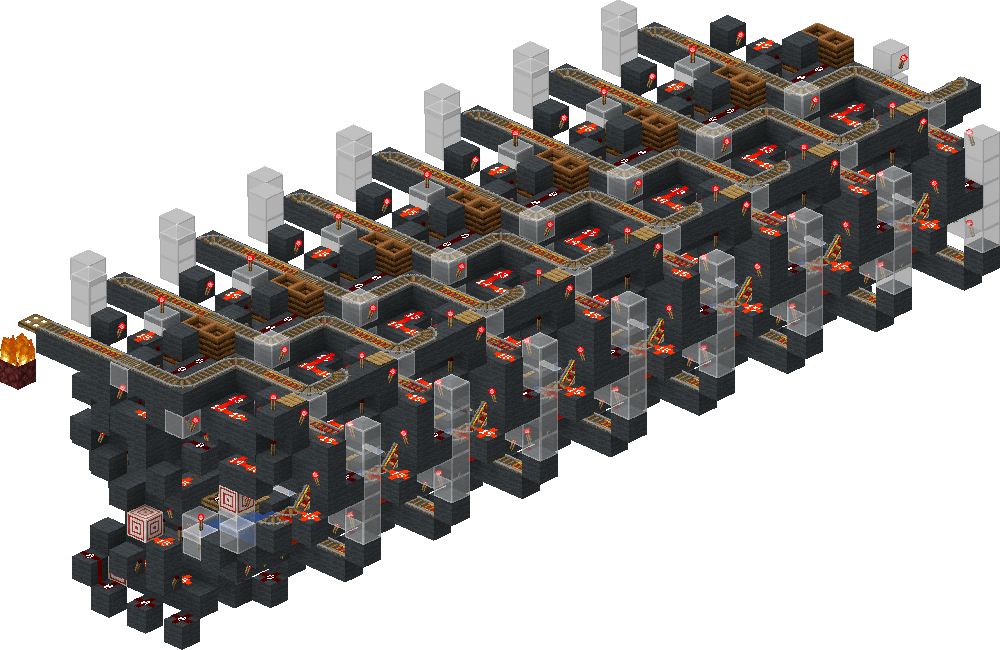
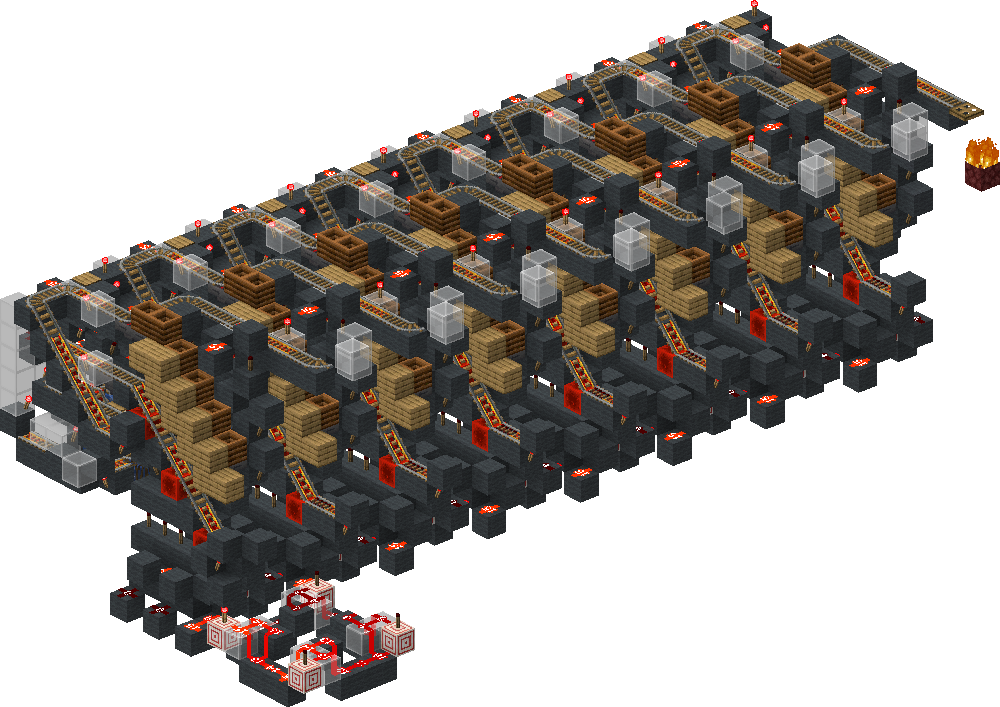

<!-- update-timestamp: 2026-08-26T18:23:00.849000+00:00 -->
Mmm my encoder takes ~90 seconds to encode that’s not awful especially considering each hall is going to have its own encoder for speed and simplicity reasons. 

I could pipeline it (sending several carts at a time through it) however that would require more logic and make it significantly more complicated…. I think it’s just better to accept that best case scenario 2 encoders at 90 seconds each (because 2 halls) is what 45s combined and honestly that’s fine imo

[View Discord message](https://discord.com/channels/@me/1520002350708686899/1544718721883439114)

<!-- update-timestamp: 2026-08-26T16:17:16.155000+00:00 -->
BEHOLD The encoder :) 

i recorded a few tests with it so ill show that in a sec but oak planks are where chests go bc wikirender likes to remove them <:Nooooo:1416716767773851668>

[View Discord message](https://discord.com/channels/@me/1520002350708686899/1544718639993983107)

## Media

<!-- update-timestamp: 2026-08-26T12:16:14.579000+00:00 -->
Ok so the idea as of now was to check after each chest of the cart was empty and from there decided if the item was found in that chest or not. 

However while with bitgrouping this seemed better because less chests (an 8bit code would be 20 chests) it’s actually slower than my new idea. See without bit grouping you need more chests because each bit of the code requires several chests. However there’s no reason I can’t just check all the chests for a given bit at the same time and with some simple logic to put the item back with trying to put an item into one of the chests and if not try the other and so on I’ll only ever need to check the equivalent of 8 chests for an 8 bit code

[View Discord message](https://discord.com/channels/@me/1520002350708686899/1544718562843824248)

<!-- update-timestamp: 2026-08-26T12:11:42.839000+00:00 -->
I had an idea how to make my encoder sooooo much faster but it’s gonna require some explaining. So bare with me for a sec lol

[View Discord message](https://discord.com/channels/@me/1520002350708686899/1544718525850198108)
