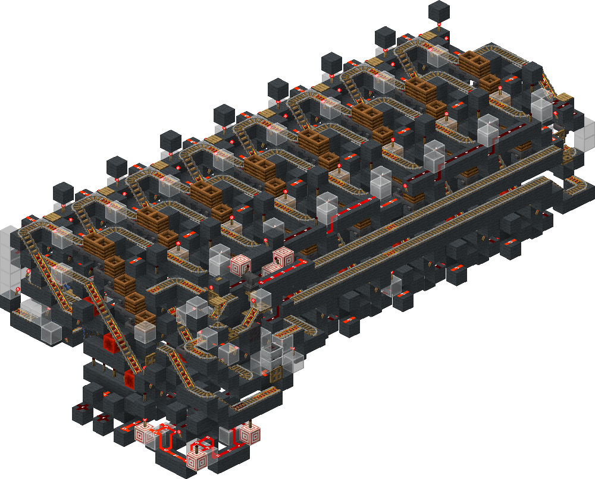
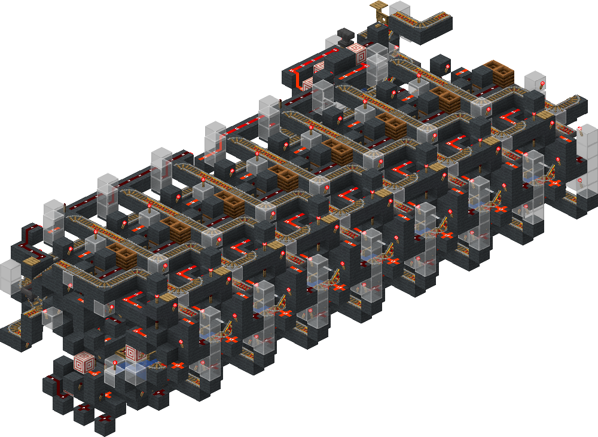

<!-- update-timestamp: 2026-08-27T18:51:40.642000+00:00 -->
It now actually loops through carts in the stack, auto stop (needs an external start signal but that’s intentional for permission handling) and uses 2 hopper carts simply to make it 2 or 3 seconds faster not needing to wait for the cart to travel back

[View Discord message](https://discord.com/channels/1411133575650213905/1533211005889282208/1542607551928074270)

<!-- update-timestamp: 2026-08-27T18:48:55.911000+00:00 -->
encoder is done :)

[View Discord message](https://discord.com/channels/1411133575650213905/1533211005889282208/1542607538628071474)

## Media

