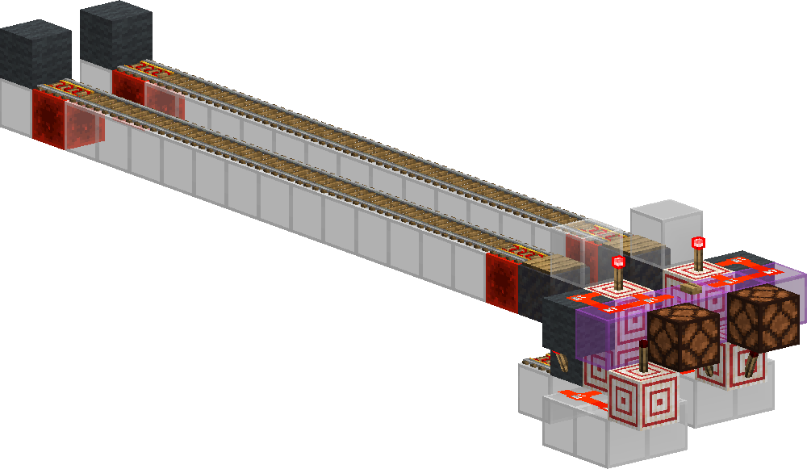
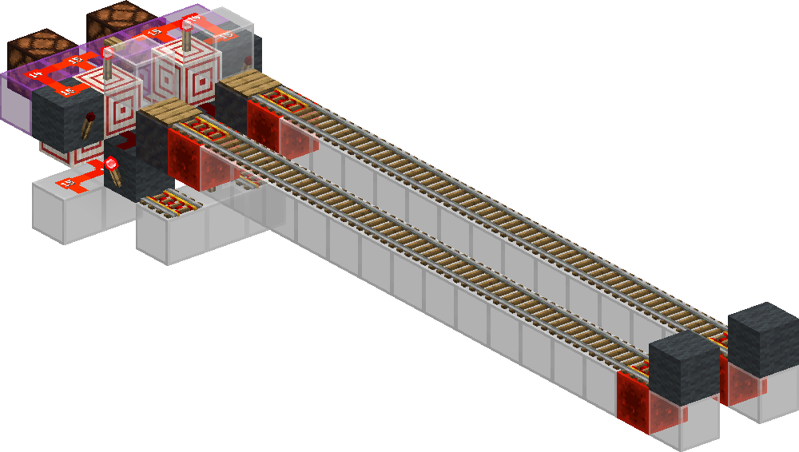
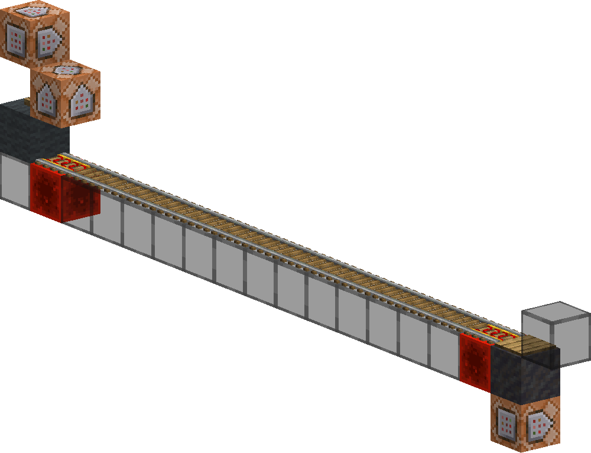

<!-- update-timestamp: 2026-09-04T21:36:13.562000+00:00 -->
The logic for finding the least full cart for the merger is done. if both are them same it goes on update order so you still only get one lamp on at the end.

[View Discord message](https://discord.com/channels/1411133575650213905/1533211005889282208/1545548064880599131)

## Media




<!-- update-timestamp: 2026-09-04T21:21:23.016000+00:00 -->
**Fill Levels and Time Difference Based From 0**
```txt
0 - +0gt
1 - +1gt
2 - +2gt
3 - +4gt
4 - +6gt
5 - +8gt
6 - +10gt
7 - +12gt
8 - +14gt
9 - +17gt
10 - +20gt
11 - +24gt
12 - +28gt
13 - +33gt
14 - +39gt
15 - +57gt
```
Its a shame its not liner but I just needed it to be different and kinds fast and a 50ish gt clock speed is ok with me.

[View Discord message](https://discord.com/channels/1411133575650213905/1533211005889282208/1545544329660076172)

<!-- update-timestamp: 2026-09-04T21:05:29.697000+00:00 -->
Every fill level of cart (0-15) triggers the end pressure plate at different times. I will be using this for ≥ (greater than or equal to) check to know what cart is the most full for my merger font logic :)

[View Discord message](https://discord.com/channels/1411133575650213905/1533211005889282208/1545540331150254181)

## Media


