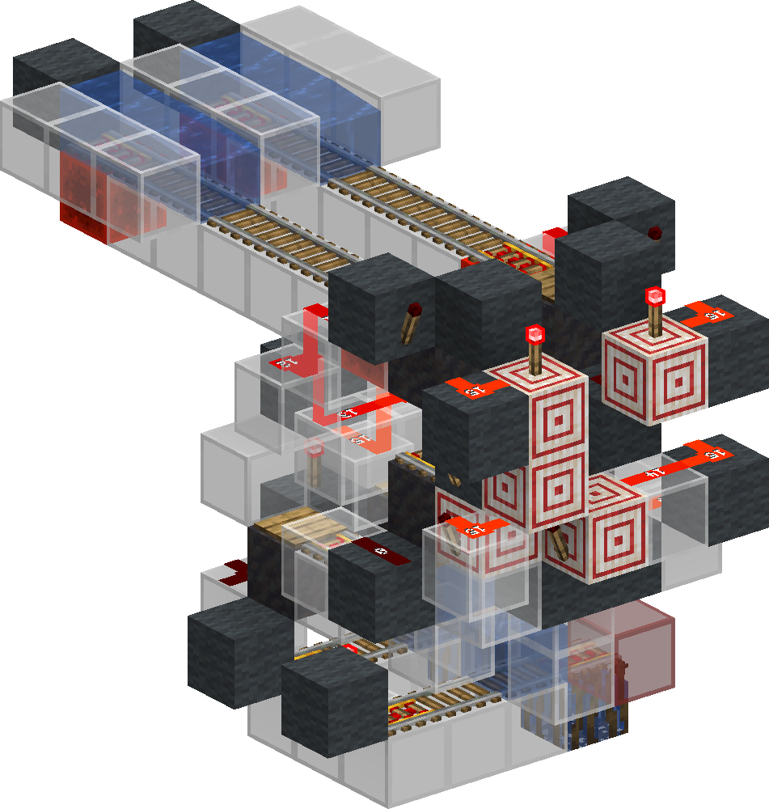
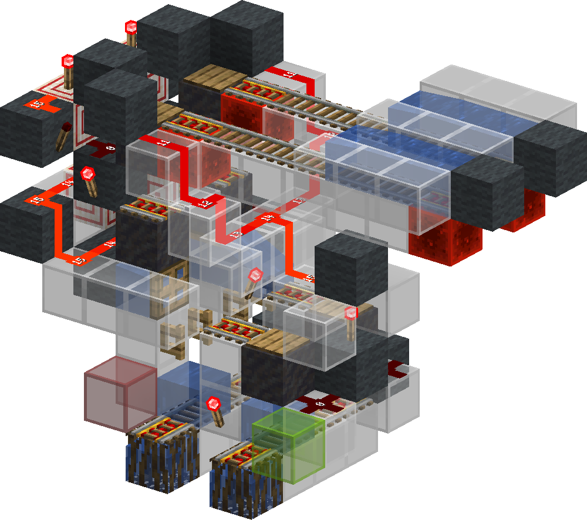

<!-- update-timestamp: 2026-09-05T22:09:30.909000+00:00 -->
Wellll fuck me… turns out the new cart logic (or well new from 1.21.4 to 26.2) adds an edge case to alllllll my stuff that uses my simple IsEmpty checker, JUST WONDERFULLY AMAZING….. 

So to recap… 

MIS - Fucked 
Splitter - Even more fucked 
Merger - fucked 

God dam it

[View Discord message](https://discord.com/channels/1411133575650213905/1533211005889282208/1545918830226972674)

<!-- update-timestamp: 2026-09-05T11:39:37.188000+00:00 -->
Most Full Cart Checker 

Most full goes to red output, least full goes to green. both carts need to start with 0 momentum and be checked at the same time. it cant handle 0 just because of i shortened the rails but i don't need it and is empty checks are not hard.

[View Discord message](https://discord.com/channels/@me/1520002350708686899/1546056575402115123)

## Media

