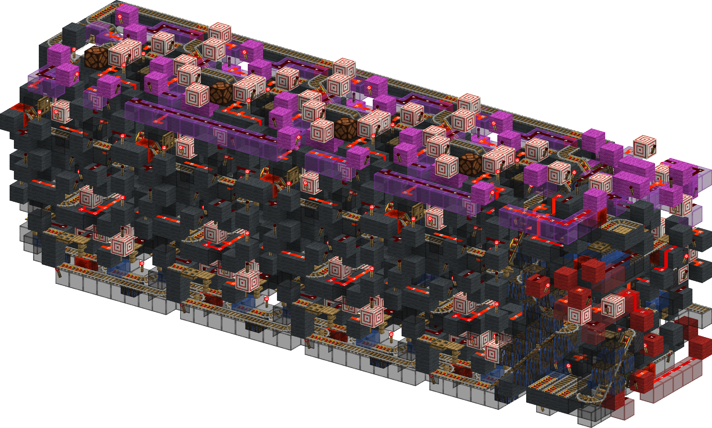
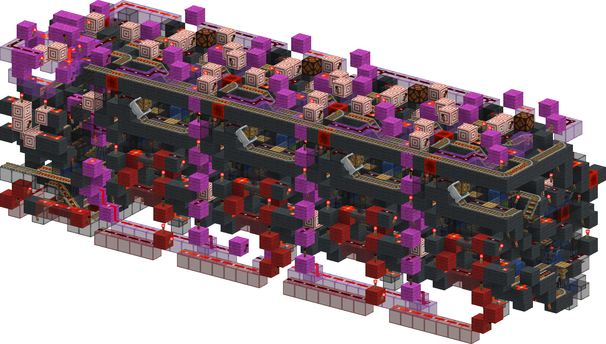
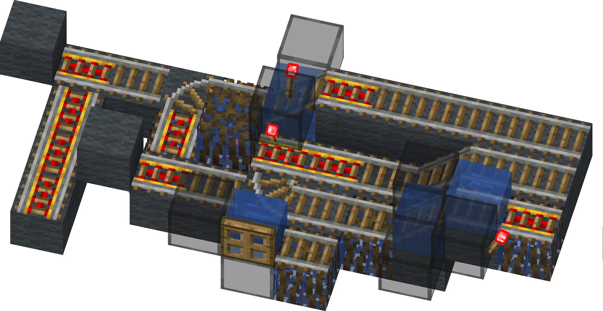
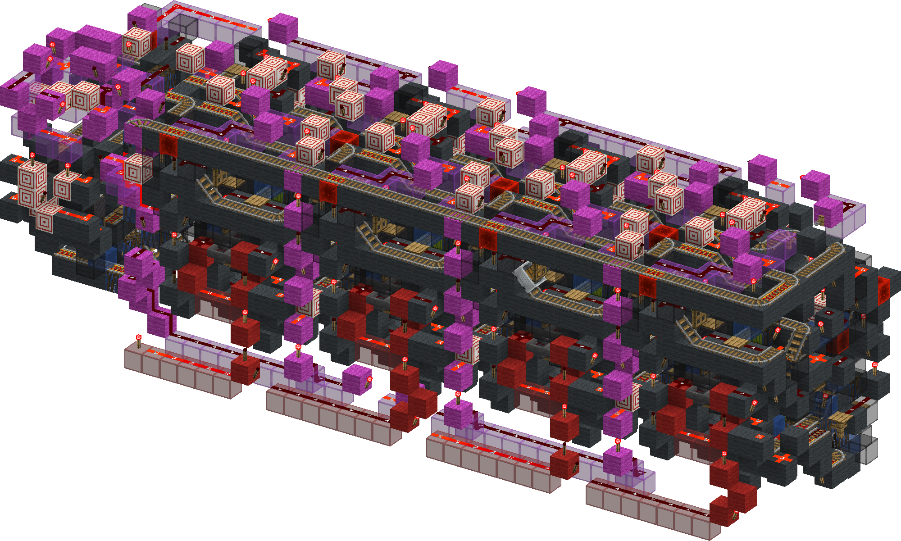
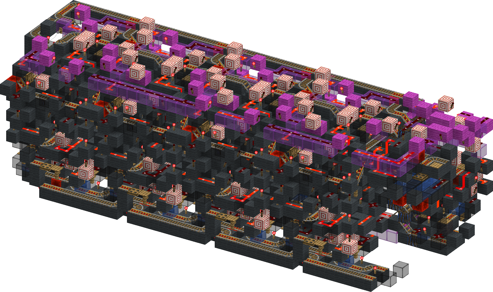
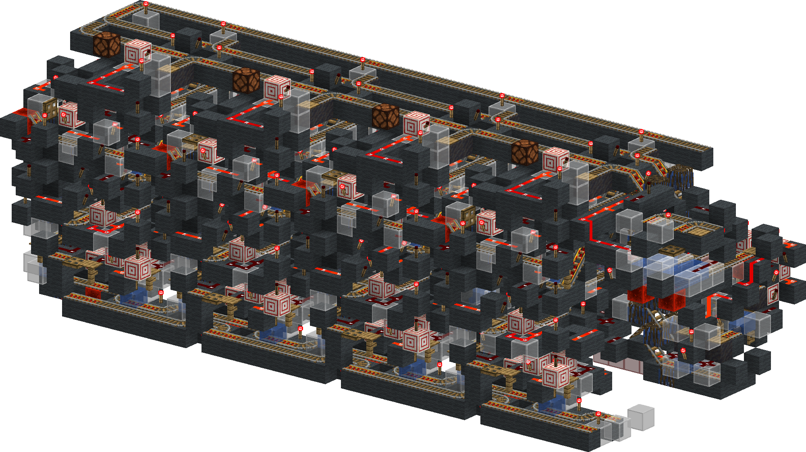
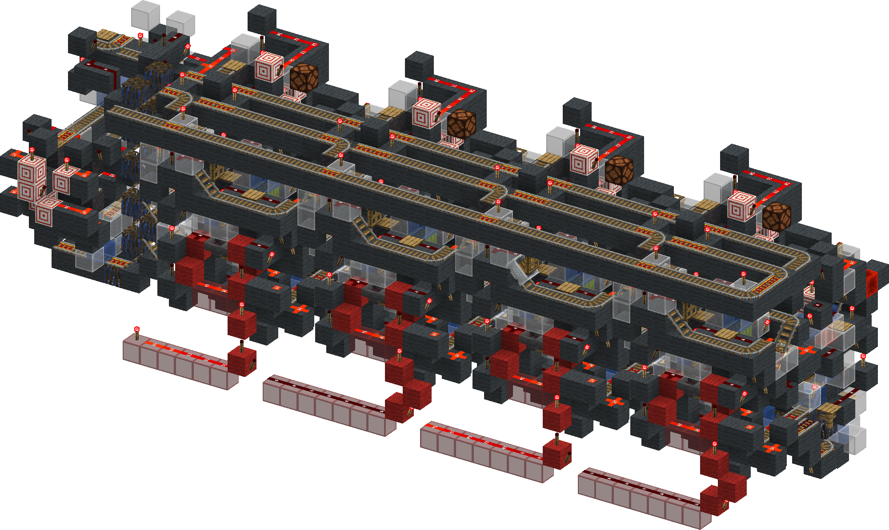

<!-- update-timestamp: 2026-09-06T19:24:50.562000+00:00 -->
ITS FINALY DONE!!!!!!!!!!!!!! 

its FHL, Auto starts (stopping is done externally for.... reasons), has fill level optimisation, fill level sorted output into: full, empty and part full and it is more then fast enough at the input it needs a 600gt delay between pairs to be safe. and I'm more then ok with that. any carts that try to be sent but all mergers are in use get sent to the front and sent out the merger this is so am external system can manage the input batter and also tell other systems the merger is at full capacity so they can be paused temporarily

[View Discord message](https://discord.com/channels/1411133575650213905/1533211005889282208/1546239776913367140)

## Media

<!-- update-timestamp: 2026-09-06T14:45:25.411000+00:00 -->
anyway.... here is a better Full, Empty, Partial checker

[View Discord message](https://discord.com/channels/1411133575650213905/1533211005889282208/1546169458773594236)

## Media

<!-- update-timestamp: 2026-09-06T13:01:33.282000+00:00 -->
all the magenta wiring is just to cover a very specific edge case 
due to sending the most full first and the least full after there is a chance a merger will reset in the middle of them and the carts will end up in different slices all this does is if a merger is running it stops the rails changing state while the carts are being sent to a slice.. but that isn't so easy.

[View Discord message](https://discord.com/channels/1411133575650213905/1533211005889282208/1546143319330001078)

## Media

<!-- update-timestamp: 2026-09-06T10:30:19.938000+00:00 -->
well that's the merger fixed

[View Discord message](https://discord.com/channels/@me/1520002350708686899/1546145393891483709)

## Media

