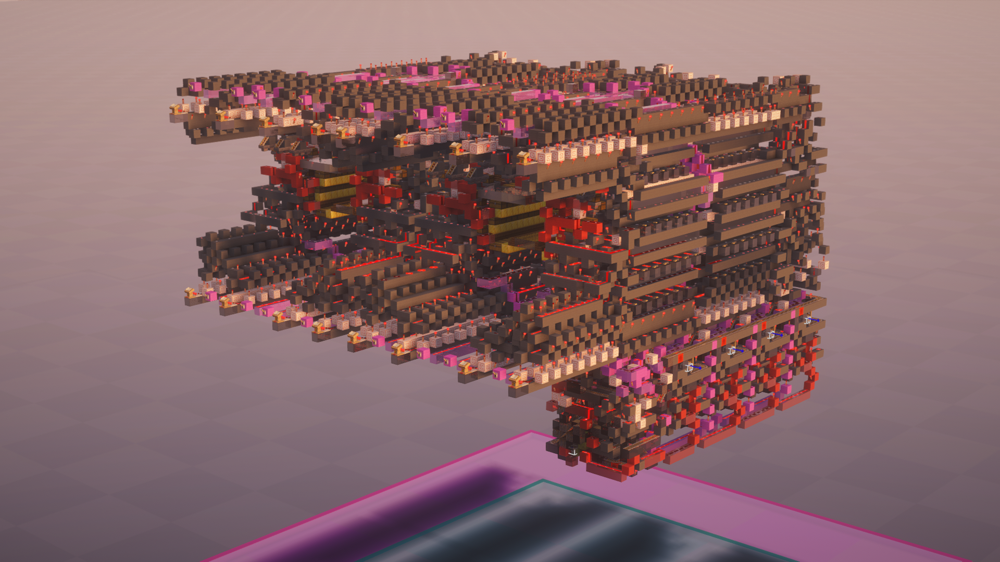
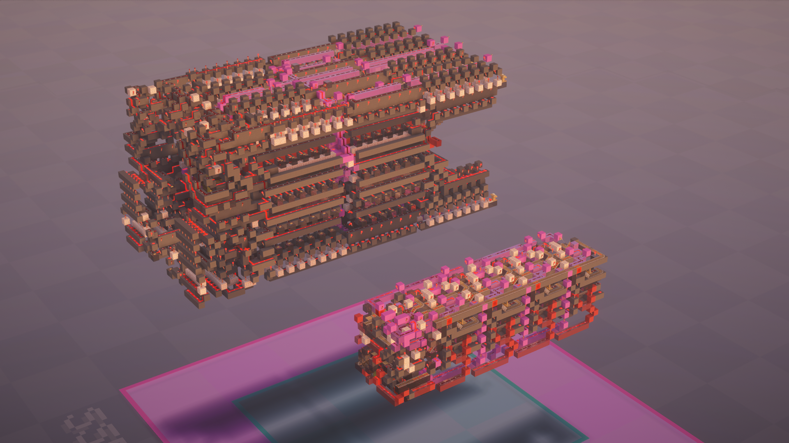
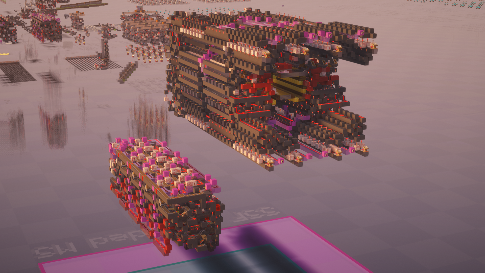
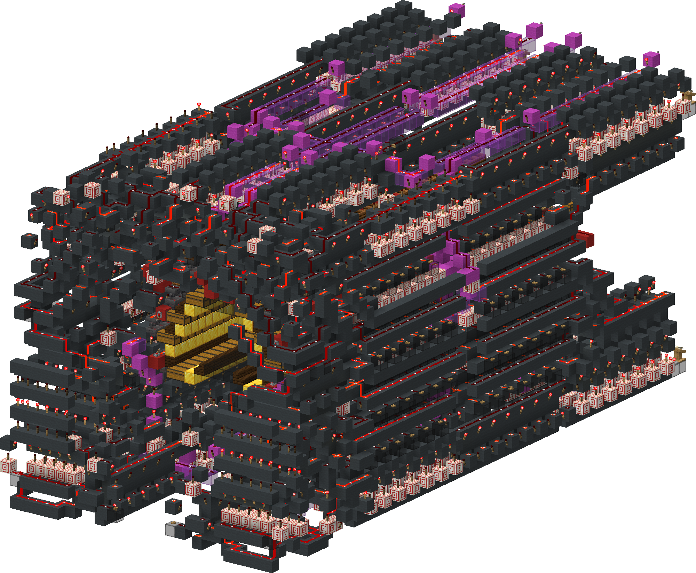
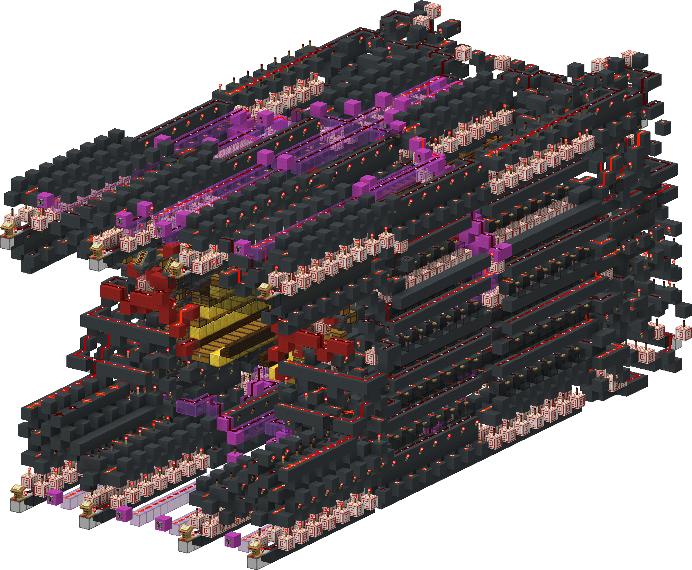
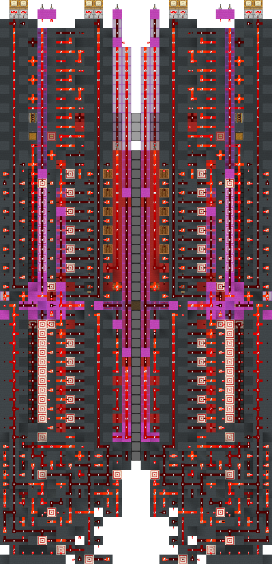
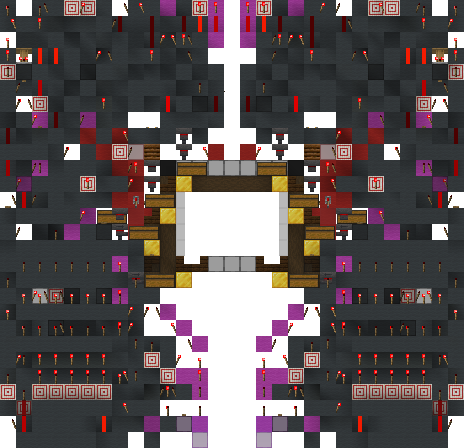

<!-- update-timestamp: 2026-09-12T19:11:16.788000+00:00 -->
I’m somewhat considering going back to binary

[View Discord message](https://discord.com/channels/1411133575650213905/1533211005889282208/1548410690891415574)

<!-- update-timestamp: 2026-09-12T17:34:06.206000+00:00 -->
i did also consider 2 halls but I think it will be overkill

[View Discord message](https://discord.com/channels/1411133575650213905/1533211005889282208/1548386235658145834)

## Media

<!-- update-timestamp: 2026-09-12T17:32:50.204000+00:00 -->
The merger looks so small

[View Discord message](https://discord.com/channels/1411133575650213905/1533211005889282208/1548385916882653264)

## Media

<!-- update-timestamp: 2026-09-12T17:20:06.179000+00:00 -->
The hall main logic is done!!!! (the 3rd and 4th images are just to show size lol)

Its FHL and is 8x

[View Discord message](https://discord.com/channels/@me/1520002350708686899/1548445866816180245)

## Media

